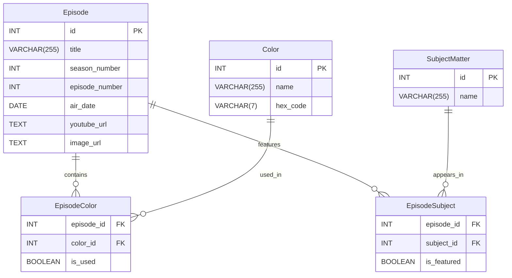

# 🎨 The Joy of Painting API  
### *An ETL-powered REST API for Bob Ross’s iconic TV series*  
> *“We don’t make mistakes — just happy little accidents.”* — Bob Ross  

[](https://www.python.org/)
[](https://www.postgresql.org/)
[](https://flask.palletsprojects.com/)
[](https://en.wikipedia.org/wiki/Extract,_transform,_load)


A full-stack ETL project that extracts, transforms, and loads data from *The Joy of Painting* into a normalized PostgreSQL database — then serves it via a powerful filtering REST API.

---

## 🎯 Features / Supported Filters
- 📅 Filter by **month** of original broadcast  
- 🎨 Filter by **color palette** (e.g., *Alizarin Crimson*, *Phthalo Blue*)  
- 🌲 Filter by **subject matter** (e.g., *Mountain*, *Cabin*, *Waterfall*)  
- ➕ Combine filters using:
  - **AND** (intersection)  
  - **OR** (union)

---

## 📂 Project Structure
```
atlas-the-joy-of-painting-api/
├── database/            # SQL schema & migrations
├── etl/                 # ETL pipeline (Python) and seed database
├── api/                 # REST API (Flask)
├── config/              # Environment & settings
├── data/                # Raw CSV inputs
│   ├── Episode Dates.csv
│   ├── Subject Matter.csv
│   └── Colors Used.csv
├── requirements.txt     # Python dependencies
├── .env.example         # Template env file (optional)
├── .env                 # Your local config
└── README.md
```

---

## Database Schema Diagram


---

## 🛠️ Setup & Installation

### **1. Prerequisites**
- Linux (Amazon Linux 2 or Ubuntu recommended)  
- Python 3.8+  
- PostgreSQL 12+  

---

### **2. Install PostgreSQL**

#### **Amazon Linux 2**
```bash
sudo amazon-linux-extras enable postgresql14
sudo yum install -y postgresql-server postgresql-contrib
sudo postgresql-setup --initdb
sudo systemctl start postgresql
sudo systemctl enable postgresql
```

#### **Ubuntu / Debian**
```bash
sudo apt update
sudo apt install -y postgresql postgresql-contrib
sudo systemctl start postgresql
sudo systemctl enable postgresql
```

---

### **3. Configure Trust Authentication (DEV ONLY)**  
Edit `pg_hba.conf` (path varies, often `/var/lib/pgsql/data/pg_hba.conf`):

```
# TYPE  DATABASE  USER      ADDRESS         METHOD
- local   all      all                       peer
+ local   all      all                       trust

- host    all      all      127.0.0.1/32    ident
+ host    all      all      127.0.0.1/32    trust
```

Restart PostgreSQL:
```bash
sudo systemctl restart postgresql
```

---

### **4. Create Database & Apply Schema**
```bash
cd ~/atlas-the-joy-of-painting-api

sudo -u postgres psql -c "CREATE DATABASE joy_of_painting;"

psql -U postgres -d joy_of_painting -f database/schema.sql
```

---

### **5. Set Up Python Environment**
```bash
python3 -m venv venv
source venv/bin/activate

pip install --upgrade pip
pip install -r requirements.txt
```

---

### **6. Configure `.env`**
```bash
cp .env.example .env
```
Modify if needed (defaults work for local development).

---

### **7. Run the ETL Pipeline**
```bash
python etl/etl_pipeline.py
```

**Expected output (~60 seconds):**
```
ETL process completed successfully!
```

Verify counts:
```bash
psql -U postgres -d joy_of_painting -c "SELECT COUNT(*) FROM Episode;"
psql -U postgres -d joy_of_painting -c "SELECT COUNT(*) FROM Color;"
psql -U postgres -d joy_of_painting -c "SELECT COUNT(*) FROM SubjectMatter;"
```

---

### **8. Start the API**
```bash
python api/app.py
```

Your server should now be running at:  
👉 **http://localhost:5000**

---

## 🌐 API Endpoints

### **Episodes**
| Method | Endpoint | Description |
|--------|----------|-------------|
| GET | `/api/episodes` | Filter episodes |
| GET | `/api/episodes/<season>/<episode>` | Full episode details |

### **Metadata**
| Method | Endpoint | Description |
|--------|----------|-------------|
| GET | `/api/colors` | List all colors |
| GET | `/api/subjects` | List all subject matters |
| GET | `/api/months` | List all months |

---

## 🔍 Filter Parameters (`GET /api/episodes`)

| Param | Type | Example | Description |
|-------|------|---------|-------------|
| `month` | int (1–12) | `?month=1` | Episodes aired in January |
| `color` | string | `?color=Alizarin%20Crimson` | Filter by color |
| `subject` | string | `?subject=Mountain` | Filter by subject |
| `filter_type` | `AND` / `OR` | `&filter_type=OR` | Combine logic (default: AND) |

---

## ✅ Example Requests

**All January episodes**
```bash
curl "http://localhost:5000/api/episodes?month=1"
```

**Episodes featuring BOTH Mountain AND Lake**
```bash
curl "http://localhost:5000/api/episodes?subject=Mountain&subject=Lake&filter_type=AND"
```

**Episodes featuring Snow OR Winter**
```bash
curl "http://localhost:5000/api/episodes?subject=Snow&subject=Winter&filter_type=OR"
```

**January episodes using Alizarin Crimson AND featuring Cabin**
```bash
curl "http://localhost:5000/api/episodes?month=1&color=Alizarin%20Crimson&subject=Cabin"
```

---

## 📦 Sample JSON Response (Episode)
```json
{
  "id": 1,
  "title": "A Walk in the Woods",
  "season": 1,
  "episode": 1,
  "air_date": "1983-01-11",
  "youtube_url": "https://www.youtube.com/embed/oh5p5f5_-7A",
  "image_url": "https://www.twoinchbrush.com/images/painting282.png"
}
```

---

## 🖼️ Full Episode Details Example
```json
{
  "id": 1,
  "title": "A Walk in the Woods",
  "season": 1,
  "episode": 1,
  "air_date": "1983-01-11",
  "youtube_url": "https://www.youtube.com/embed/oh5p5f5_-7A",
  "image_url": "https://www.twoinchbrush.com/images/painting282.png",
  "colors": [
    "Alizarin Crimson",
    "Bright Red",
    "Cadmium Yellow",
    "Phthalo Green",
    "Prussian Blue",
    "Sap Green",
    "Titanium White",
    "Van Dyke Brown"
  ],
  "subjects": [
    "Bushes",
    "Deciduous",
    "Grass",
    "Trees"
  ]
}
```

---

## 🧪 Testing & Debugging

### Install `jq` (optional)
**Amazon Linux**
```bash
sudo yum install -y jq
```

**Ubuntu**
```bash
sudo apt install -y jq
```

### Pretty-print test output
```bash
curl "http://localhost:5000/api/episodes?month=12&subject=Snow" | jq '.'
```

---

## 📊 Data Sources (Provided CSVs)

| File | Rows | Description |
|------|------|-------------|
| Episode Dates.csv | 403 | Episode titles & air dates |
| Subject Matter.csv | ~70 | All subjects appearing in episodes |
| Colors Used.csv | ~18 | All colors Bob Ross used |

---

## 🎉 Enjoy the API!
Whether you're analyzing patterns, building a frontend, or just celebrating Bob Ross — have fun!

